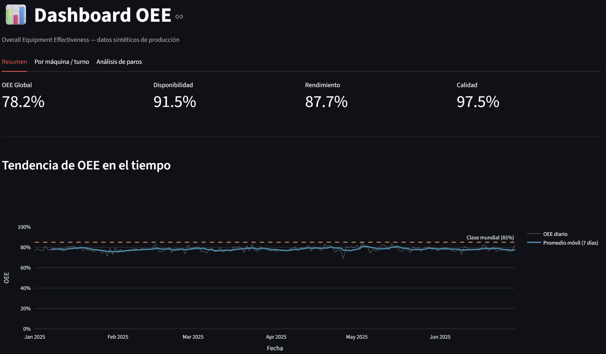

# OEE Dashboard

[](https://github.com/MarianoVera22/oee-dashboard/actions/workflows/ci.yml)
[](https://www.python.org/downloads/)
[](https://streamlit.io/)
[](https://github.com/astral-sh/ruff)

Dashboard interactivo de **OEE (Overall Equipment Effectiveness)** para análisis de
eficiencia en líneas de producción industrial. Calcula y visualiza disponibilidad,
rendimiento y calidad por máquina, turno y fecha, e identifica las principales causas
de paro mediante un análisis de Pareto.

> **Nota sobre los datos:** este proyecto usa un **dataset sintético** generado con
> lógica de negocio realista (variación por turno y máquina, causas de paro con
> distribución de Pareto). Los datos no provienen de una planta real, pero el modelo
> de OEE y los cálculos siguen los estándares de la industria.

## Demo en vivo

🔗 **[Ver dashboard desplegado](https://marianovera-oee-dashboard.streamlit.app/)**



## ¿Qué es el OEE?

El OEE es el indicador estándar para medir la eficiencia de un equipo productivo:

**OEE = Disponibilidad × Rendimiento × Calidad**

- **Disponibilidad**: cuánto tiempo operó la máquina respecto al planificado (afectada por paros).
- **Rendimiento**: qué tan cerca produjo de su velocidad nominal.
- **Calidad**: qué proporción de la producción salió sin defectos.

Un OEE del 85% se considera de clase mundial; entre 60-70% es típico en la industria.

## Características

- **KPIs en tiempo real**: OEE global y sus tres componentes.
- **Filtros interactivos**: por máquina y turno, afectan toda la vista.
- **Tendencia temporal**: evolución diaria con promedio móvil de 7 días para revelar la tendencia de fondo.
- **Análisis de Pareto**: identifica las causas de paro que concentran la mayor pérdida de tiempo.
- **Comparativas**: OEE por máquina y por turno.

## Stack técnico

- **[Polars](https://pola.rs/)**: procesamiento de datos (más rápido que pandas).
- **[Streamlit](https://streamlit.io/)**: framework de dashboard en Python puro.
- **[Plotly](https://plotly.com/python/)**: gráficos interactivos.
- **Calidad**: `pytest` (tests), `mypy --strict` (tipos), `ruff` (lint + formato), GitHub Actions (CI).

## Instalación y uso

Requiere Python 3.13+ y [uv](https://docs.astral.sh/uv/).

```bash
git clone https://github.com/MarianoVera22/oee-dashboard.git
cd oee-dashboard
uv sync

# Generar el dataset sintético
uv run python generate_data.py

# Levantar el dashboard
uv run streamlit run app.py
```

El dashboard se abre en `http://localhost:8501`.

## Arquitectura

```text
oee-dashboard/
├── src/oee_dashboard/
│   ├── metrics.py        # Cálculo de OEE y agregaciones (lógica de negocio)
│   └── py.typed          # Marcador de tipado (PEP 561)
├── tests/
│   └── test_metrics.py   # Tests de los cálculos de OEE
├── data/                 # Datasets generados (CSV)
├── generate_data.py      # Generador de datos sintéticos
├── app.py                # Aplicación Streamlit
└── pyproject.toml
```

La lógica de cálculo (`metrics.py`) está **separada de la presentación** (`app.py`):
las métricas son funciones puras de polars, testeadas de forma independiente del dashboard.

## Desarrollo

```bash
uv run pytest                  # tests
uv run mypy .                  # verificación de tipos
uv run ruff check .            # linting
uv run ruff format .           # formateo
```

## Licencia

MIT
